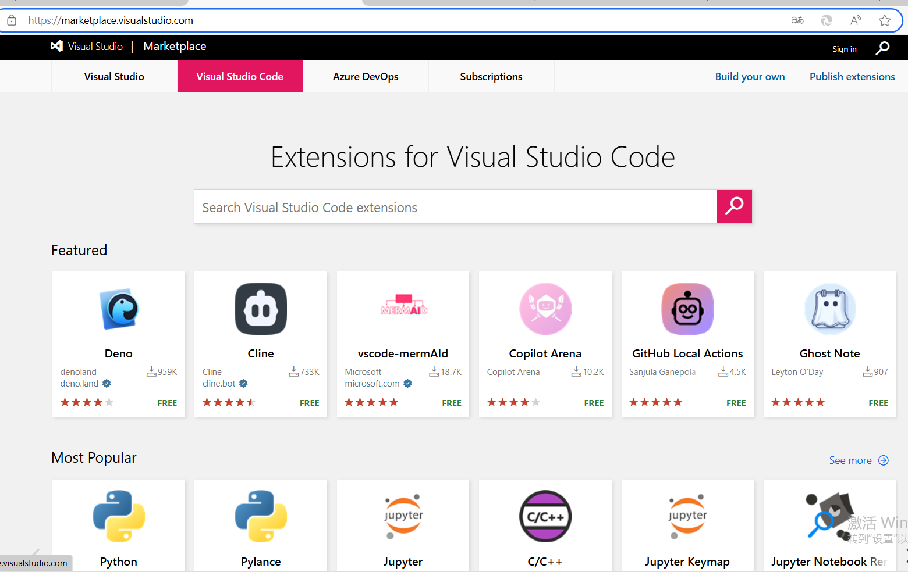
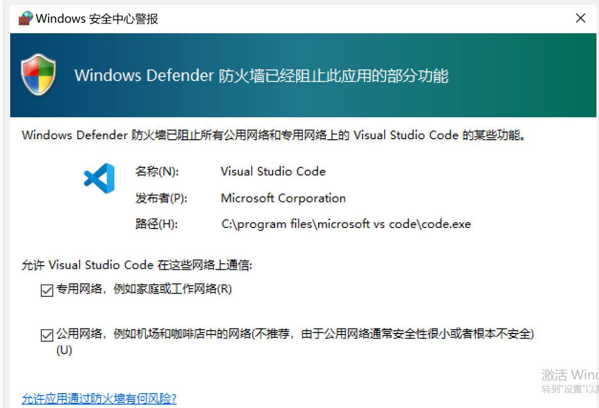
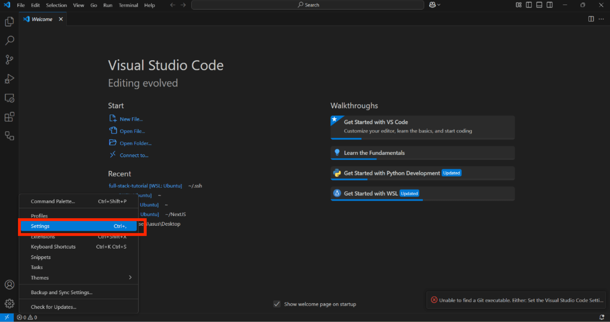
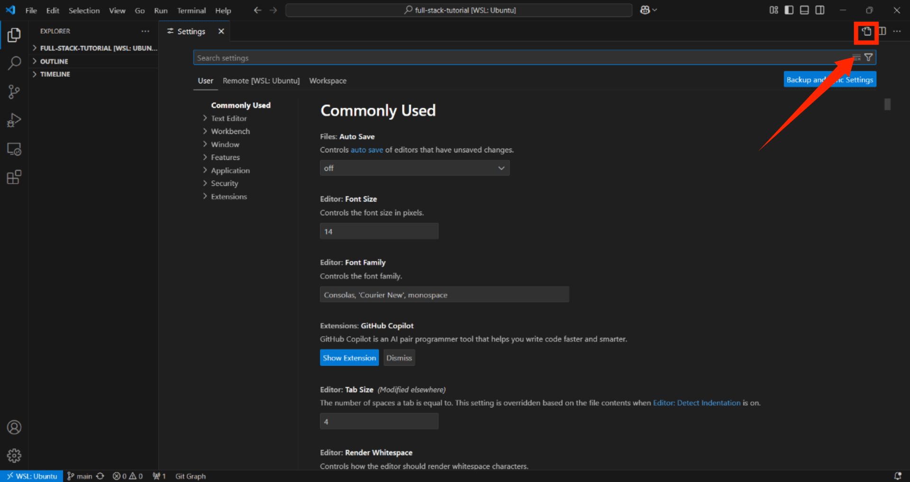

# 如何处理vscode安装插件异常
让我们通过以下步骤来解决插件安装失败

## 1. 检查网络是否异常
在浏览器中输入以下网址，看是否能访问，若能则不存在网络问题
```
https://marketplace.visualstudio.com
```
如果一切正常，您应该在`https://marketplace.visualstudio.com`有一个Extensions for Visual Studio Code的页面。



## 2. 防火墙阻止
当我们第一次启动调试功能的时候，正常情况vscode会弹出防火墙阻止的界面



## 3. 设置代理




在`setting.json`中添加以下代理
```
  "http.proxy": "http://127.0.0.1:7897",
  "https.proxy": "http://127.0.0.1:7897",
  "http.proxyAuthorization": null,
  "http.proxyStrictSSL": false
```

## 4. clash配置
如果以上步骤都解决不了，需要查看以下`clash`的配置是否完成

## 5. 配置恢复
当需要安装的插件安装完成后，就可以上面的代理配置给注释了