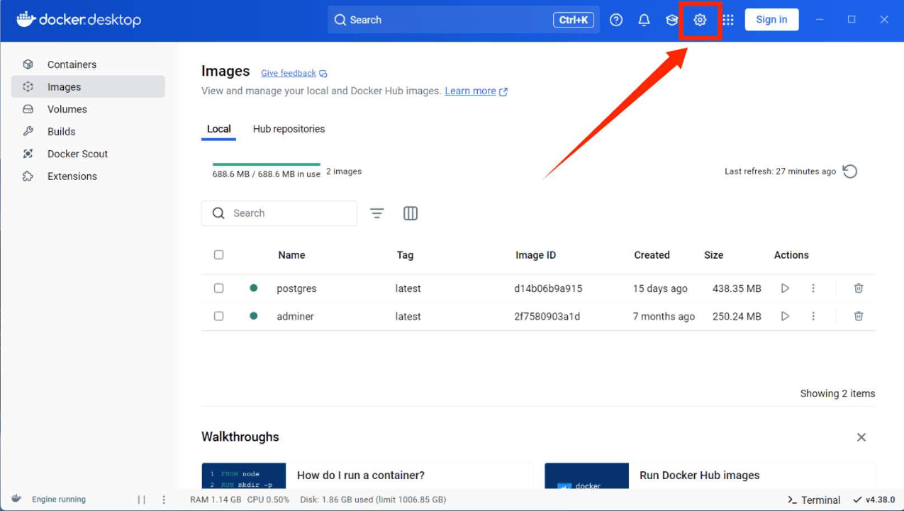
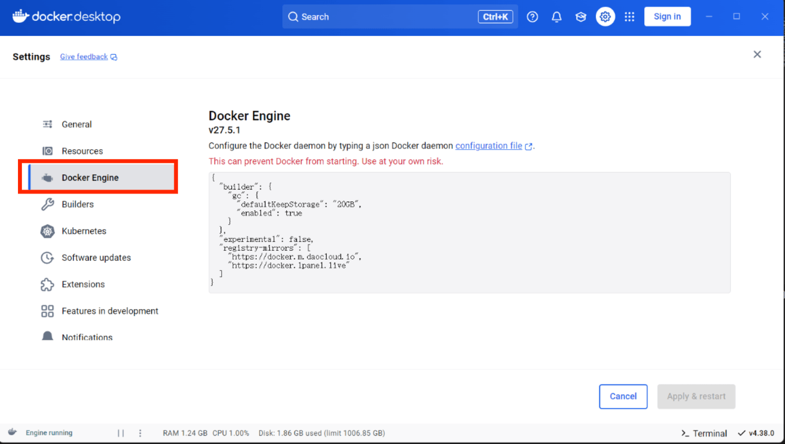

# docker的安装与使用
docker是一种开源平台，用于开发、部署和运行应用程序。

## 先决条件
1. 确保您的系统是windows专业版
2. 已安装了wsl2 

##  docker的安装
### 1. 开启windows功能
通过控制面板，开启Hyper-v和适用于windows子系统功能


### 2. 下载并安装docker
下载docker最安全的路径就是去官网，安装时要注意勾选`wsl`选项，安装成功后跳过登录docker Hub账号
```
https://docs.docker.com/desktop/install/windows-install/
```

## docker的使用
### 1. 配置镜像
进入docker后，开始配置镜像





配置镜像添加以下内容
```                           
"registry-mirrors":["https://docker.m.daocloud.io","https://docker.1panel.live"]
```
 
### 2. 拉取镜像
 这里我在wsl命令行中拉取的postgres镜像，运行以下命令：`pull`              
 ```
 sudo docker pull postgres
 ```

### 3. 创建并启动容器
创建包含以下内容的文件：`docker-compose.yml`     


### 4. 验证容器启动
运行以下命令`ps`，当STATUS出现`up`的时候，容器就表示启动成功                   
```
docker ps
```

  
