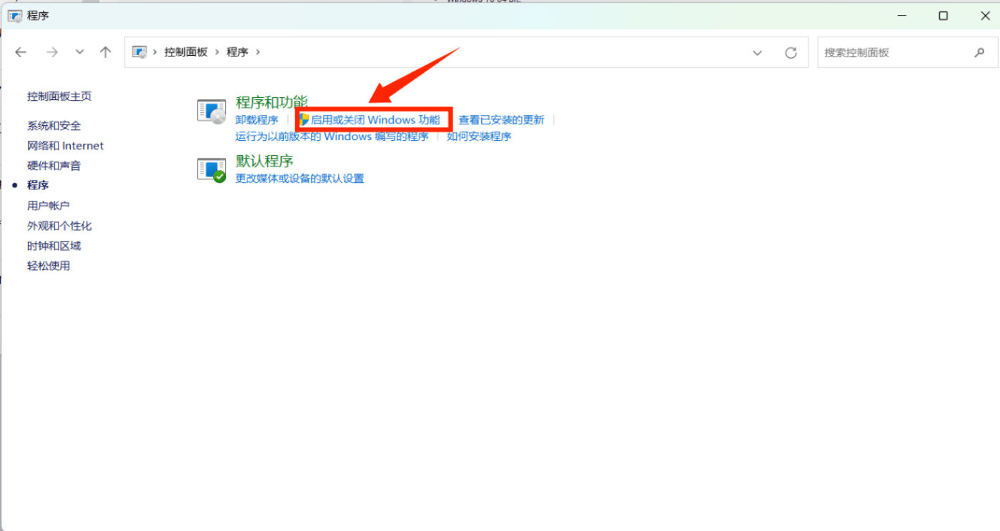
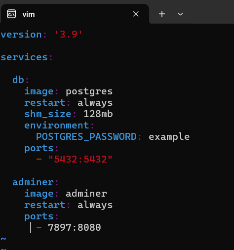

## docker的安装与使用
### 1. docker的安装
#### 1.1 首先将windows系统更改为windows专业版，然后打开控制面板，点击程序，后点击启动或关闭windows功能，将Hyper-v和适用于windows子系统勾选,具体如下图所示

#### 1.2 在命令行中下载wsl2

#### 1.3 在官网下载docker
`https://docs.docker.com/desktop/install/windows-install/`

#### 1.4 进行安装，注意要勾选wsl选项，安装好后选择跳过登录docker Hub账号

### 2.docker的使用
#### 2.1 进入docker后，开始配置镜像,这里我用的是wsl中配置镜像，输入以下命令后，按ESC键，输入:wq!就完成了
                                              
`sudo vi /etc/docker/daemon.json`                              
`{"registry-mirrors":["https://docker.m.daocloud.io","https://docker.1panel.live"]}`
 
#### 2.2 现在开始拉取postgres镜像,在wsl中输入以下命令                
 `sudo docker pull postgres`

#### 2.3 创建并启动容器
创建docker-compose.yml文件                         
`touch docker-compose.yml`                                     
写入文件                                                       
`vim docker-compose.yml`                                       
文件内容如下图所示

其中version是指定docker compose文件的版本;db:服务名称;image:postgre s表示使用官方的PostgreSQL镜像；restart:always表示容器总是自动重启；environment表示设置环境变量；POSTGRES_PASSWORK:example表示设置PostgreSQL的密码为example；ports：7897：8080表示主机端口7897映射到容器端口8080

#### 2.4 查看正在运行容器(验证容器启动成功的方式)       
当STATUS出现up容器就启动成功                    
  `docker ps`
  
