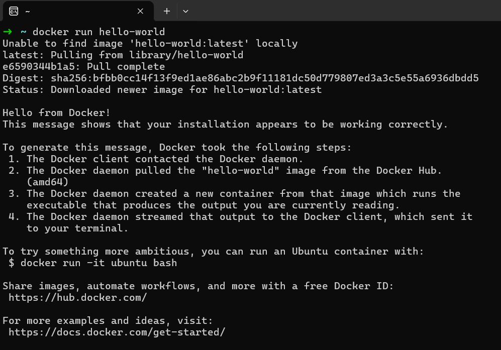

# docker的安装与验证
docker是一种开源平台，用于开发、部署和运行应用程序。

## 先决条件
1. 确保您的系统是windows专业版
2. 已安装了wsl2 

>**提示**                                                                                                                                  
如果没有安装wsl2，可以参考[安装wsl文档](https://learn.microsoft.com/zh-cn/windows/wsl/install)

##  docker的安装
### 1. 开启windows功能
通过控制面板，开启Hyper-v和适用于windows子系统功能


### 2. 下载并安装docker
下载docker最安全的路径就是去官网，安装时要注意勾选`wsl`选项，安装成功后跳过登录docker Hub账号
```
https://docs.docker.com/desktop/install/windows-install/
```

## 配置Docker镜像
安装docker后，进入docker，开始配置镜像


配置镜像添加以下内容
```                           
"registry-mirrors":["https://docker.m.daocloud.io","https://docker.1panel.live"]
```
 
 ## 验证Docker
 运行以下命令，测试Docker是否正确安装并运行
 ```
 docker run hello-world
 ```
 当输出`Hello from Docker`命令时，表明Docker安装正确
 

