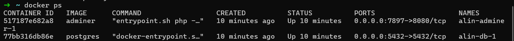

# Docker启动数据库
使用Docker启动PostgreSQL数据库

## 先决条件
1. 已安装Docker
2. 以wsl为开发环境

##  拉取 PostgreSQL 镜像
在wsl中,运行以下命令来拉取 `PostgreSQL` 镜像:
 ```
 sudo docker pull postgres
 ```

## 创建文件并启动容器
### 1. 创建`docker-compose.yml`文件
运行以下命令，创建`docker-compose.yml`文件
```
touch docker-compose.yml
```
### 2. 编写文件
在`docker-compose.yml`文件中，写入以下内容：
```
version: '3.9'

services:

  db:
    image: postgres
    restart: always
    shm_size: 128mb
    environment: 
      POSTGRES_PASSWORD: example
    ports:
      - "5432:5432"

  adminer:
    image: adminer
    restart: always
    ports:
      - 7897:8080
```
### 3. 启动`PostgreSQL`数据库
运行以下命令启动`PostgreSQL`数据库：
```
docker-compose up --build
```

### 4. 验证启动
运行以下命令`ps`，当STATUS出现`up`的时候，容器就表示启动成功                   
```
docker ps
```


### 5. 连接到PostgreSQL数据库
运行以下命令，连接到PostgreSQL数据库：
```
docker exec -it my-postgres psql -U postgres
```

