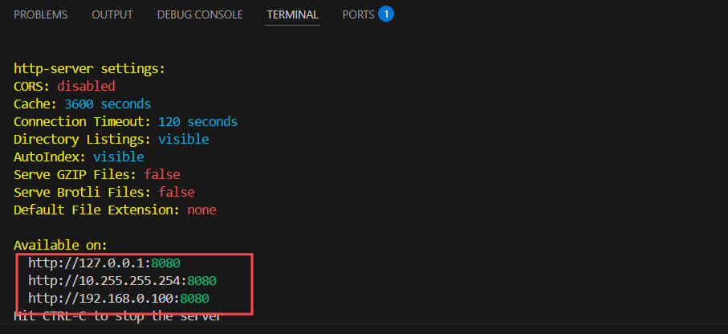

# http-server
了解访问HTML网页的流程，可以通过http-server模拟过程

## 安装与启动
### 1. 安装http-server
运行以下命令进行安装，其中`-g`代表全局安装
```
npm install -g http-server
```
### 2. 启动http-server
在控制台运行以下命令来启动服务
```
http-server
```
启动成功后，命令行会输出以下网址


### 3. 用户输入网址
用户在浏览器的地址栏中输入以下网址
```
http:localhost:8080
```
按下`F12`，进入检查


### 4. 无痕模式
用户可以使用以下快捷键，打开无痕窗口
```
Ctrl+Shift+N
```
按下`F12`，再次进入检查，发现未报错

