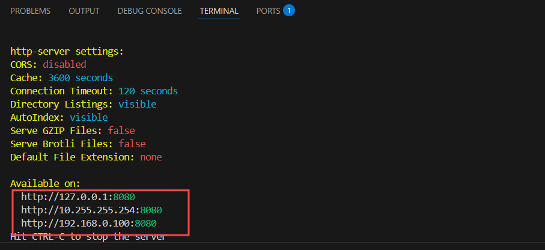
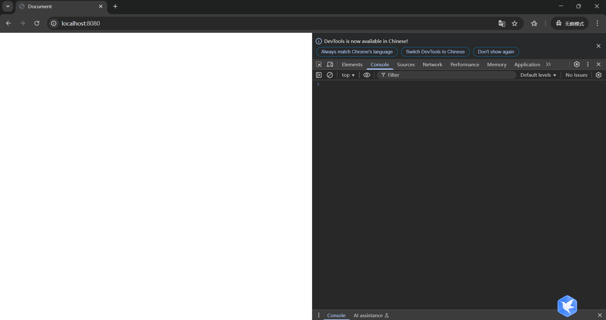
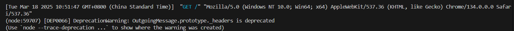
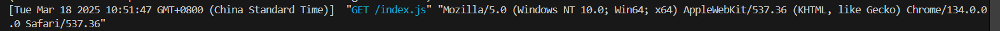

# 访问 HTML 网页的流程

我们将通过 `http-server` 来模拟访问 HTML 网页的过程，从浏览器、网络和服务器这几个方面详细介绍。

## 创建index.html
1. 对于创建`index.html`文件，可以参考[使用VScode](https://idealjs.github.io/full-stack-tutorial/docs/web/hello_world/use_vscode)文档
2. 在`index.html`文件输入内容，可以参考[第一个页面(hello world)](https://idealjs.github.io/full-stack-tutorial/docs/web/hello_world/first_page)文档

## 安装http-server
运行以下命令进行安装，其中`-g`代表全局安装
```
npm install -g http-server
```

## 启动http-server
### 1.进入文件夹
安装完成并创建好`index.html`文件后，就可以通过以下命令进入包含`index.html`文件的文件夹
```
cd ~/test
```
### 2.启动服务
在控制台运行以下命令来启动服务
```
http-server
```
启动成功后，命令行会输出以下网址

这时，你可以在浏览器中输入 `http://127.0.0.1:8080` 或者`http://localhost:8080` 来访问你的网页

## 无痕模式
用户可以使用以下快捷键，打开无痕窗口
```
Ctrl+Shift+N
```
按下`F12`，进入检查


## 先决条件
- 你需要已经安装并启动 `http-server`。

## 浏览器的工作步骤

### 1. 建立 TCP 连接
浏览器会向 `127.0.0.1:8080` 发送建立 TCP 连接的请求。服务器收到请求后，会确认客户端的身份，然后向客户端回复消息，从而建立起服务器与客户端之间的连接。

### 2. 发送 GET 请求
浏览器会向服务器发送一个路径为 `/` 的 GET 请求。



## 服务器的工作步骤

### 1. 查找文件
当服务器接收到浏览器的请求后，就像一位仓库管理员，会在众多文件中查找 `index.html` 文件。



### 2. 生成 HTTP 响应
服务器找到文件后，会对其进行处理，将其转换为适合在网络中传输的 HTTP 响应，如同把货物包装好以便运输。

### 3. 发送响应
服务器会通过之前与浏览器建立的“运输通道”（TCP 连接），将生成的 HTTP 响应发送给浏览器。

## 渲染页面

### 1. 接收资源并渲染
- 浏览器接收到资源后解析HTML、CSS和JavaScript
- 浏览器根据解析结果构建页面结构

### 2. 显示页面
页面渲染完成后，就会展示给用户。