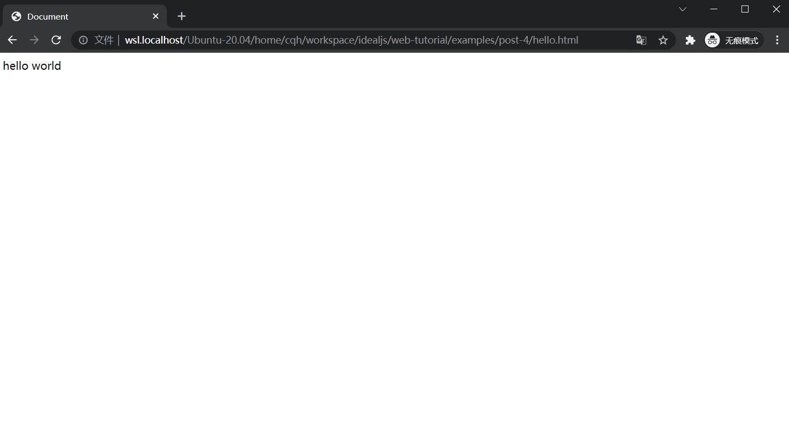

# HTML5 Hello World

在学习一样新技术的时候，写一个 Hello World 是最简单的。

用最少的知识量，让程序完整的跑起来，就是 Hello World 的目的。

本篇的完整代码，可以在这里找到：

- examples/post-4/hello.html

## 查看这个网页

查看这个 Hello World 很简单，只需要把这个 hello.html 文件下载到计算机。然后用浏览器打开就可以了。



## 简单分析代码

```html
<!DOCTYPE html>
<html lang="en">
  <head>
    <meta charset="UTF-8" />
    <meta http-equiv="X-UA-Compatible" content="IE=edge" />
    <meta name="viewport" content="width=device-width, initial-scale=1.0" />
    <title>Document</title>
  </head>
  <body>
    <div>Hello World</div>
  </body>
</html>
```

通过上面的 Hello World 可以看出来一些 HTML5 的语法规则。

- 标签需要闭合 —— `<div/>` 或这样的 `<div></div>`
- 标签有独特的含义 —— `<xxx></xxx>`, `<div></div>` 是 HTML5 的块标签

具体的标签规则，可以参考 [HTML5 标签](http://www.w3chtml.com/html5/tag/)。（实际工作中，用到的种类没有列出来的这么多）
