# Prisma使用教程
Prisma是一个现代化的数据库工具和ORM(对象关系映射)框架。

## 先决条件
1. 已安装Node.js 18+
2. 一个Prisma Postgres数据
3. 一个Node.js工程
4. 一个Vercel账户

## 设置Prisma ORM

### 1. 安装并初始化Prisma OMR

我们需要安装一些依赖项，在终端的根项目下，运行以下代码
```
npm install prisma --save-dev
npm install tsx --save-dev
npm install @prisma/extension-accelerate
```
然后，项目初始化Prisma ORM,运行以下命令：`init`
```
npx prisma init
```
这时会出现新目录，里面包含`schema.prsma`文件，在文件中添加以下代码：
```
model User {
  id    Int     @id @default(autoincrement())
  email String  @unique
  name  String?
  posts Post[]
}

model Post {
  id        Int     @id @default(autoincrement())
  title     String
  content   String?
  published Boolean @default(false)
  authorId  Int
  author    User    @relation(fields: [authorId], references: [id])
}
```

### 2. 配置PostgreSQL数据库连接
打开`.env`文件，配置PostgreSQL数据库连接字符串。例如
```
DATABASE_URL=""
```
打开PostgreSQL数据库控制台
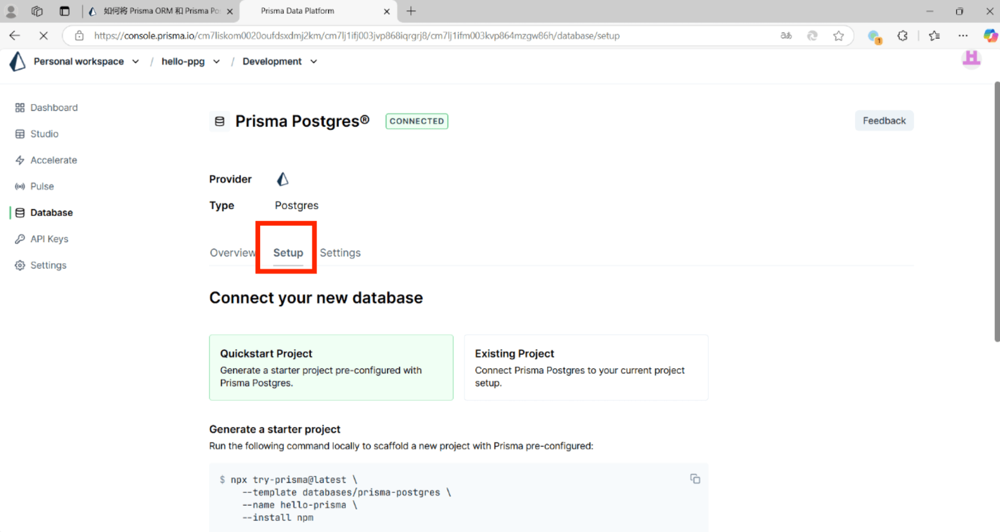

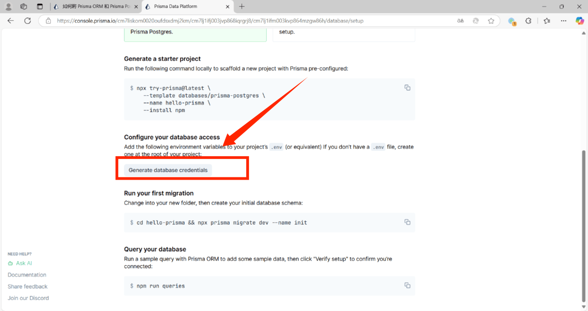

### 3. 更新数据库架构
配置完后，可以使用以下命令将架构应用到数据库中：`prisma migrate dev`
```
npx prisma migrate dev --name init
```

### 4. 为数据库设定种子
在prisma目录下创建`seed.ts`文件并写入以下内容：
```
import { PrismaClient, Prisma } from '@prisma/client'

const prisma = new PrismaClient()

const userData: Prisma.UserCreateInput[] = [
  {
    name: 'Alice',
    email: 'alice@prisma.io',
    posts: {
      create: [
        {
          title: 'Join the Prisma Discord',
          content: 'https://pris.ly/discord',
          published: true,
        },
        {
          title: 'Prisma on YouTube',
          content: 'https://pris.ly/youtube',
        },
      ],
    },
  },
  {
    name: 'Bob',
    email: 'bob@prisma.io',
    posts: {
      create: [
        {
          title: 'Follow Prisma on Twitter',
          content: 'https://www.twitter.com/prisma',
          published: true,
        },
      ],
    },
  }
]

export async function main() {
  for (const u of userData) {
    await prisma.user.create({ data: u })
  }
}

main()
```
在`package.json`添加以下配置:
```
 "prisma": {
    "seed": "tsx prisma/seed.ts"
  },
```
运行使用刚刚`seed.ts`文件中定义的初始数据为数据库种子
```
npx prisma db seed
```
现在有一个包含一些初始数据的数据库，可以通过运行以下命令来迁出数据库的数据
```
npx prisma studio
```
迁出成功可以看到一些初始的数据
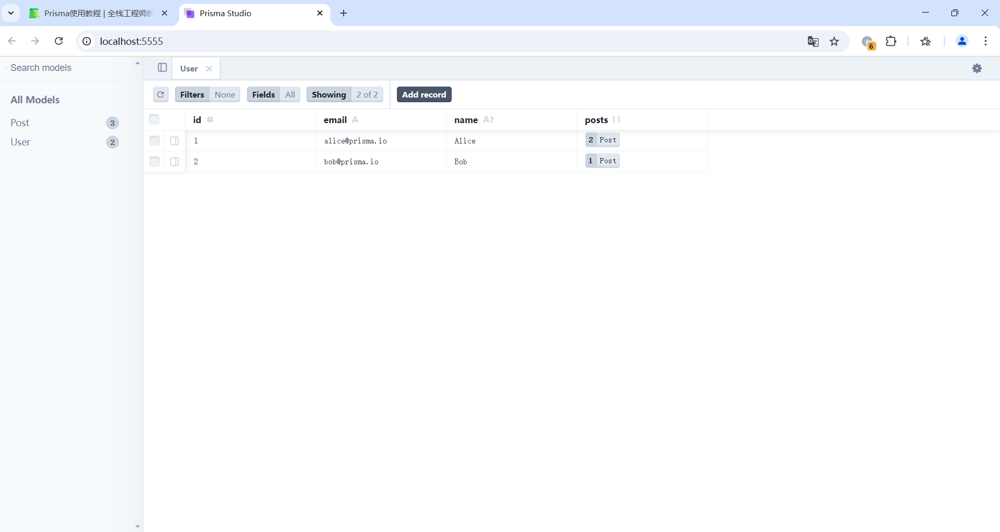

### 5. 设置Prisma客户端
通过以下命令，在项目的根目录中，创建一个新目录并添加一个文件：
```
mkdir -p lib && touch lib/prisma.ts
```
将以下代码添加到文件中：
```
import { PrismaClient } from '@prisma/client'
import { withAccelerate } from '@prisma/extension-accelerate'

const prisma = new PrismaClient().$extends(withAccelerate())

const globalForPrisma = global as unknown as { prisma: typeof prisma }

if (process.env.NODE_ENV !== 'production') globalForPrisma.prisma = prisma

export default prisma
```
### 6. 使用Prisma ORM查询数据库
打开`app/page.tsx`文件并替换为以下内容：
```
export default async function Home() {
  return (
    <div className="min-h-screen bg-gray-50 flex flex-col items-center justify-center -mt-16">
      <h1 className="text-4xl font-bold mb-8 font-[family-name:var(--font-geist-sans)] text-[#333333]">
        Superblog
      </h1>
      <ol className="list-decimal list-inside font-[family-name:var(--font-geist-sans)]">
        <li className="mb-2">Alice</li>
        <li>Bob</li>
        <li>ALin</li>
      </ol>
    </div>
  );
}
```
显示为静态页面
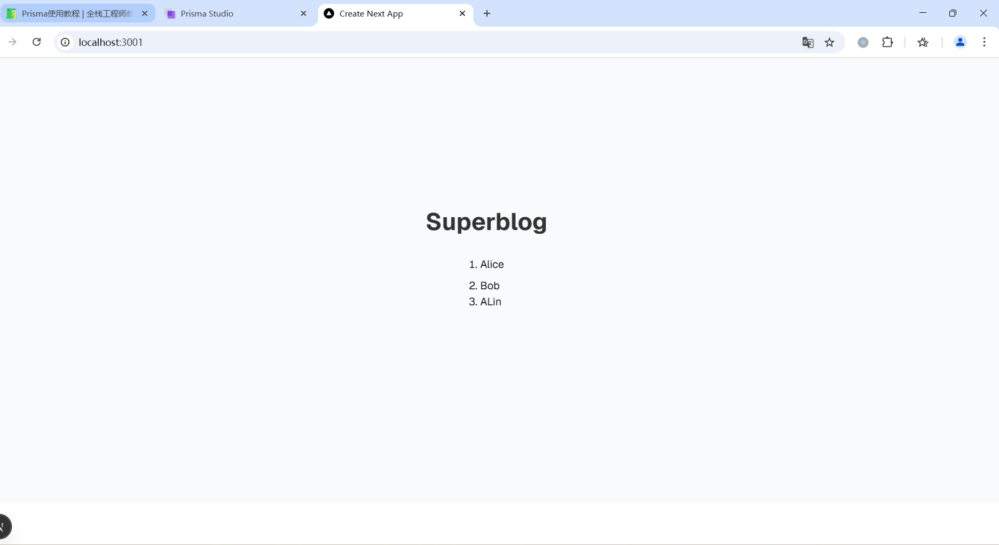

现在让我们更新页面从我们的数据库中获取用户并使其动态显示数据库中的用户,添加`app/page.tsx`文件的内容：
```
import prisma from '@/lib/prisma'

export default async function Home() {
  const users = await prisma.user.findMany();
  return (
    <div className="min-h-screen bg-gray-50 flex flex-col items-center justify-center -mt-16">
      <h1 className="text-4xl font-bold mb-8 font-[family-name:var(--font-geist-sans)] text-[#333333]">
        Superblog
      </h1>
      <ol className="list-decimal list-inside font-[family-name:var(--font-geist-sans)]">
        {users.map((user) => (
          <li key={user.id} className="mb-2">
            {user.name}
          </li>
        ))}
      </ol>
    </div>
  );
}
```
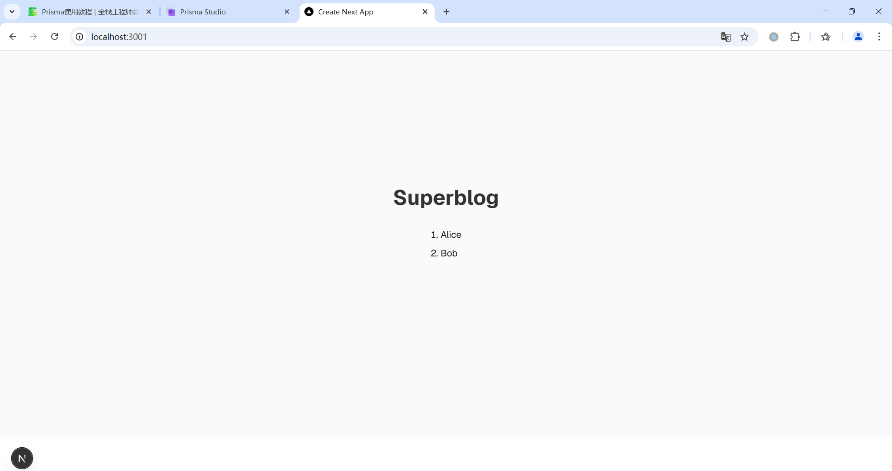

### 7. 添加新的Posts列表页面
运行以下命令，在目录中创建一个新目录，并在其中创建一个新文件：
```
mkdir -p app/posts && touch app/posts/page.tsx
```
将以下静态代码添加到文件`app/posts/page.tsx`中：
```
import prisma from "@/lib/prisma";

export default async function Posts() {
  return (
    <div className="min-h-screen bg-gray-50 flex flex-col items-center justify-center -mt-16">
      <h1 className="text-4xl font-bold mb-8 font-[family-name:var(--font-geist-sans)] text-[#333333]">
        Posts
      </h1>
      <ul className="font-[family-name:var(--font-geist-sans)] max-w-2xl space-y-4">
          <li>My first post</li>
           <li>My Alin</li>
      </ul>
    </div>
  );
}
```
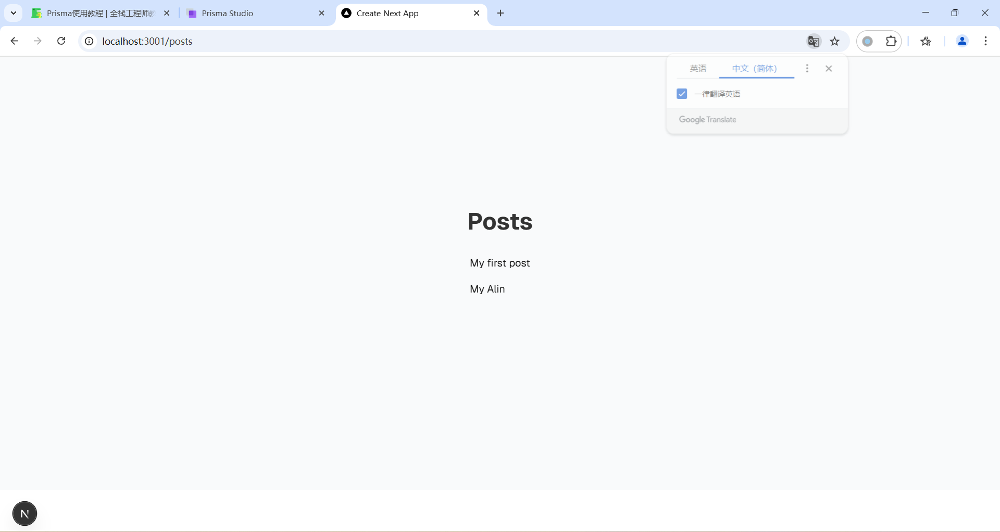
将以上代码更改为动态代码，如下所示：
```
import prisma from "@/lib/prisma";

export default async function Posts() {
  const posts = await prisma.post.findMany({
    include: {
      author: true,
    },
  });

  return (
    <div className="min-h-screen bg-gray-50 flex flex-col items-center justify-center -mt-16">
      <h1 className="text-4xl font-bold mb-8 font-[family-name:var(--font-geist-sans)] text-[#333333]">
        Posts
      </h1>
      <ul className="font-[family-name:var(--font-geist-sans)] max-w-2xl space-y-4">
        <li>My first post</li>
        {posts.map((post) => (
          <li key={post.id}>
            <span className="font-semibold">{post.title}</span>
            <span className="text-sm text-gray-600 ml-2">
              by {post.author.name}
            </span>
          </li>
        ))}
      </ul>
    </div>
  );
}
```

可以看到在Prisma Client查询中使用了每篇文章的作者，显示作者的姓名

### 8. 添加新的Posts详情页面
运行以下命令，在该目录中，创建新目录`posts/[id]`并在其中创建一个新文件`page.tsx`：
```
mkdir -p 'app/posts/[id]' && touch 'app/posts/[id]/page.tsx'
```
将以下静态代码添加到文件中，此页面会显示单个文章的标题、内容和作者：
```
import prisma from "@/lib/prisma";

export default async function Post({ params }: { params: Promise<{ id: string }> }) {
  return (
    <div className="min-h-screen bg-gray-50 flex flex-col items-center justify-center -mt-16">
      <article className="max-w-2xl space-y-4 font-[family-name:var(--font-geist-sans)]">
        <h1 className="text-4xl font-bold mb-8 text-[#333333]">My first post</h1>
        <p className="text-gray-600 text-center">by Anonymous</p>
        <div className="prose prose-gray mt-8">
          No content available123.
        </div>
      </article>
    </div>
  );
}
```
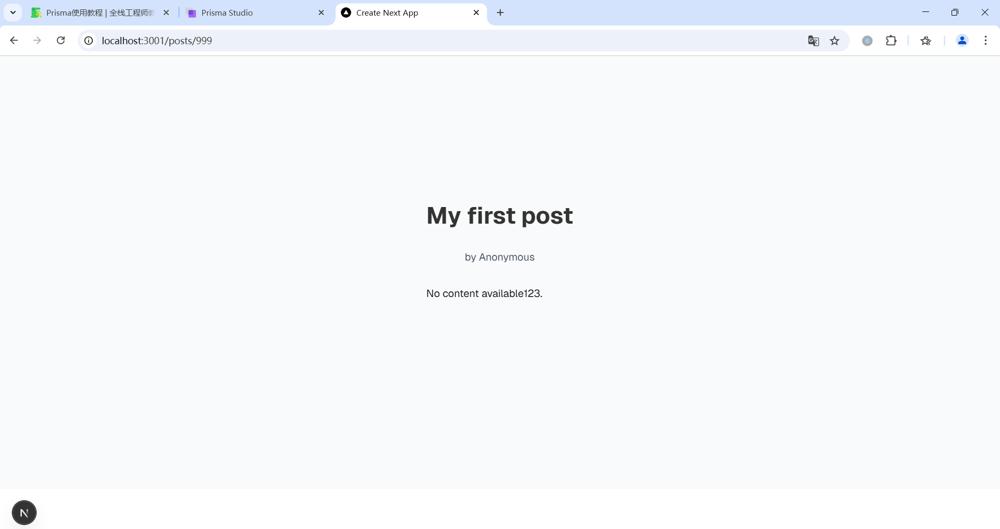
当我们在地址栏中输入`localhost:3001/posts/1`,`localhost:3001/posts/2`,`localhost:3001/posts/999`其页面的内容都不会变化

现在我们将以上代码修改为动态代码：
```
import prisma from "@/lib/prisma";
import { notFound } from "next/navigation";

export default async function Post({ params }: { params: Promise<{ id: string }> }) {
  const { id } = await params;
  const post = await prisma.post.findUnique({
    where: { id: parseInt(id) },
    include: {
      author: true,
    },
  });

  if (!post) {
    notFound();
  }

  return (
    <div className="min-h-screen bg-gray-50 flex flex-col items-center justify-center -mt-16">
      <article className="max-w-2xl space-y-4 font-[family-name:var(--font-geist-sans)]">
        <h1 className="text-4xl font-bold mb-8 text-[#333333]">My first post</h1>
        <p className="text-gray-600 text-center">by Anonymous</p>
        <div className="prose prose-gray mt-8">
          No content available.
        </div>
        <h1 className="text-4xl font-bold mb-8 text-[#333333]">{post.title}</h1>
        <p className="text-gray-600 text-center">by {post.author.name}</p>
        <div className="prose prose-gray mt-8">
          {post.content || "No content available."}
        </div>
      </article>
    </div>
  );
}
```
当我们在地址栏中输入`localhost:3001/posts/1`，会显示以下页面
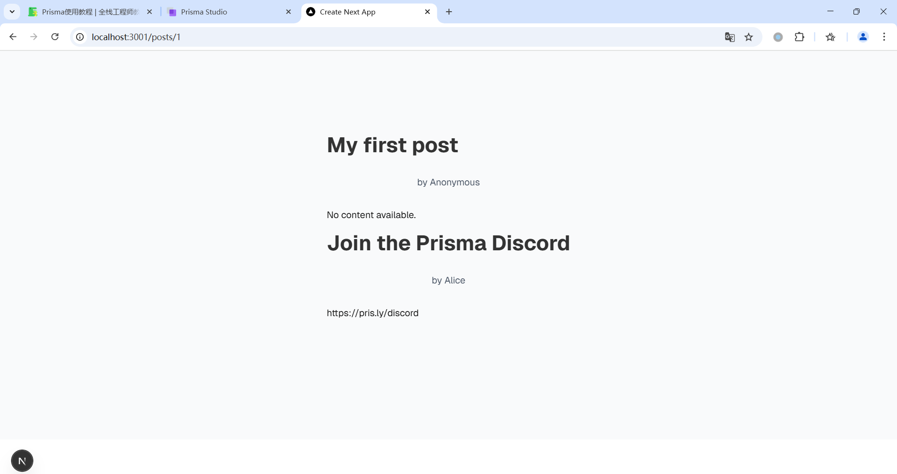
当我们在地址栏中输入`localhost:3001/posts/2`，会显示以下页面
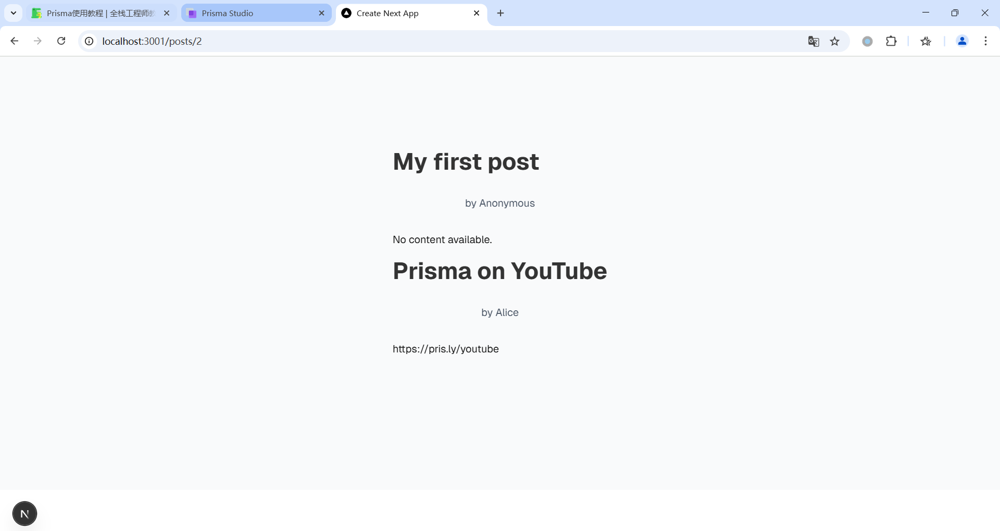
当我们在地址栏中输入`localhost:3001/posts/2`，如果不存在（可能已经被删除或输入了错误的ID）就会调用显示404页面
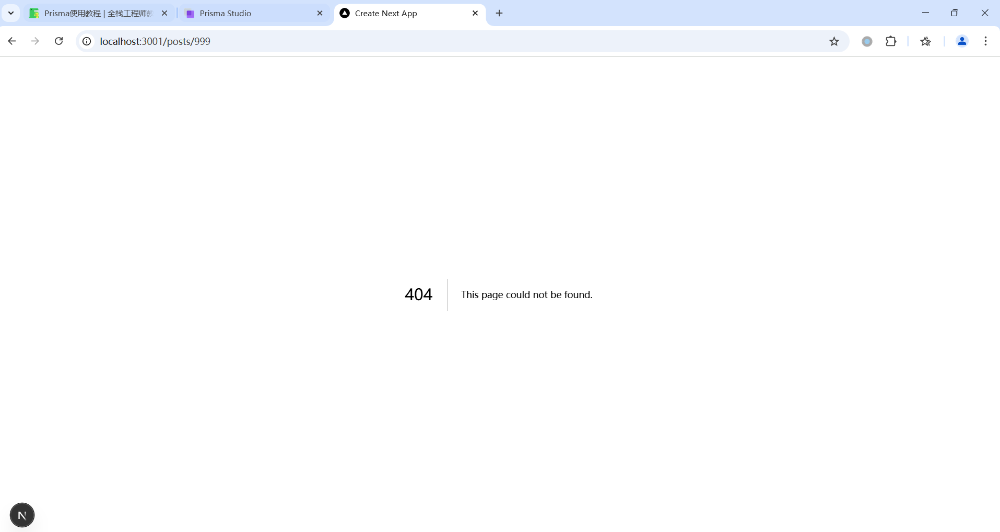

### 9. 添加新的Posts create页面
为了完善应用程序，将添加一个`create`页面,运行以下命令，先创建一个目录并在其添加一个新文件：
```
mkdir -p app/posts/new && touch app/posts/new/page.tsx
```
在文件中添加以下静态代码：
```
import Form from "next/form";

export default function NewPost() {
  async function createPost(formData: FormData) {
    "use server";

    const title = formData.get("title") as string;
    const content = formData.get("content") as string;
  }

  return (
    <div className="max-w-2xl mx-auto p-4">
      <h1 className="text-2xl font-bold mb-6">Create New Post</h1>
      <Form action={createPost} className="space-y-6">
        <div>
          <label htmlFor="title" className="block text-lg mb-2">
            Title
          </label>
          <input
            type="text"
            id="title"
            name="title"
            placeholder="Enter your post title"
            className="w-full px-4 py-2 border rounded-lg"
          />
        </div>
        <div>
          <label htmlFor="content" className="block text-lg mb-2">
            Content
          </label>
          <textarea
            id="content"
            name="content"
            placeholder="Write your post content here..."
            rows={6}
            className="w-full px-4 py-2 border rounded-lg"
          />
        </div>
        <button
          type="submit"
          className="w-full bg-blue-500 text-white py-3 rounded-lg hover:bg-blue-600"
        >
          Create Post
        </button>
      </Form>
    </div>
  );
}
```
在地址栏中输入`localhost:3001/posts/new`，会显示以下页面
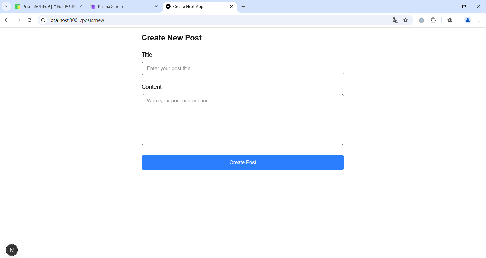

在文件中添加以下动态代码：
```
import Form from "next/form";
import prisma from "@/lib/prisma";
import { revalidatePath } from "next/cache";
import { redirect } from "next/navigation";

export default function NewPost() {
  async function createPost(formData: FormData) {
    "use server";

    const title = formData.get("title") as string;
    const content = formData.get("content") as string;

    await prisma.post.create({
      data: {
        title,
        content,
        authorId: 1,
      },
    });

    revalidatePath("/posts");
    redirect("/posts");
  }

  return (
    <div className="max-w-2xl mx-auto p-4">
      <h1 className="text-2xl font-bold mb-6">Create New Post</h1>
      <Form action={createPost} className="space-y-6">
        <div>
          <label htmlFor="title" className="block text-lg mb-2">
            Title
          </label>
          <input
            type="text"
            id="title"
            name="title"
            placeholder="Enter your post title"
            className="w-full px-4 py-2 border rounded-lg"
          />
        </div>
        <div>
          <label htmlFor="content" className="block text-lg mb-2">
            Content
          </label>
          <textarea
            id="content"
            name="content"
            placeholder="Write your post content here..."
            rows={6}
            className="w-full px-4 py-2 border rounded-lg"
          />
        </div>
        <button
          type="submit"
          className="w-full bg-blue-500 text-white py-3 rounded-lg hover:bg-blue-600"
        >
          Create Post
        </button>
      </Form>
    </div>
  );
}
``` 
在地址栏中输入`localhost:3001/posts/new`，填写其中内容，会显示以下页面

填写完成后页面会自动跳转到列表页面
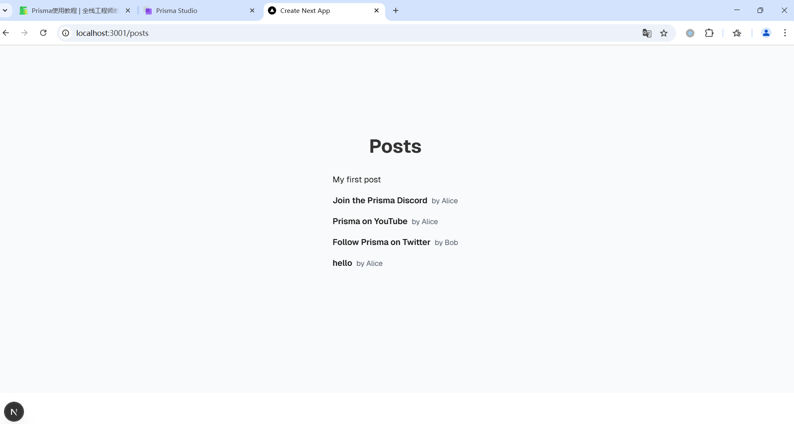
