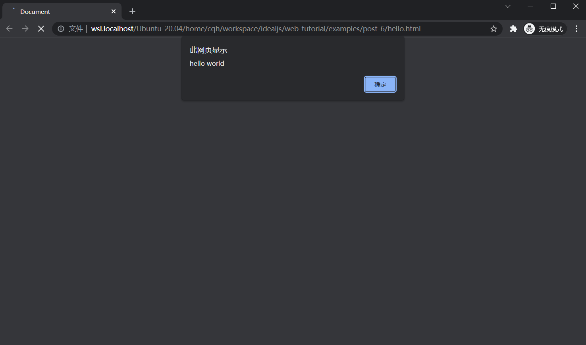

# JS Hello World

继续学习 Hello World。

Web 由 HTML5 + CSS3 + JS 构成。本节将介绍 JS 的 Hello World。

> 用最少的知识量，让程序完整的跑起来，就是 Hello World 的目的。

本篇的完整代码，可以在这里找到：

- [examples/post-6/hello.html](https://github.com/idealjs/full-stack-tutorial/blob/main/examples/post-6/hello.html)

## 查看这个网页

查看这个 Hello World 很简单，只需要把这个 hello.html 文件下载到计算机。然后用浏览器打开就可以了。



## 简单分析代码

```html
<!DOCTYPE html>
<html lang="en">
  <head>
    <meta charset="UTF-8" />
    <meta http-equiv="X-UA-Compatible" content="IE=edge" />
    <meta name="viewport" content="width=device-width, initial-scale=1.0" />
    <title>Document</title>
    <script>
      window.onload = () => {
        alert("hello world");
      };
    </script>
  </head>
  <body></body>
</html>
```

我们需要关注的是如下代码块，其余部分是 HTML5 的标签，想了解的话，可以查看[HTML5 Hello World](https://idealjs.github.io/full-stack-tutorial/docs/post-4)。

```html
<script>
  window.onload = () => {
    alert("hello world");
  };
</script>
```

形式上，被 `<script></script>` 包裹住的内容就是 JS 脚本。

这个脚本会在浏览器解析到这个标签时执行。

- `window.onload = xxx` 是在做一个赋值操作。

  将一个函数赋值给 `onload` 属性。而浏览器在加载`hello.html` 文档结束时，会运行 `onload` 函数。

- `() => { alert("hello world"); }` 称作匿名的箭头函数，具体可以查阅 JS 文档。

- `alert("hello world");` 是 JS 调用了浏览器提供的函数 `alert` 其中参数，我们填入了 `"hello world"` 字符串
