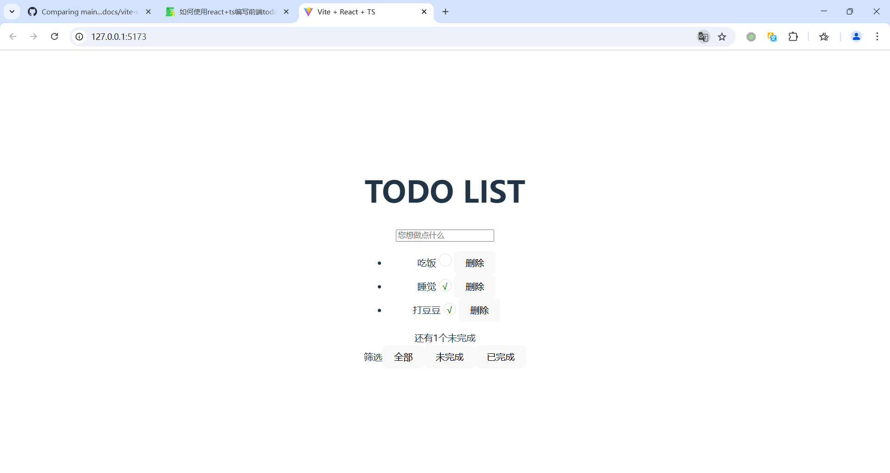

# 如何使用react+ts编写前端todo list
本文将编写一个简单的前端todo list应用，从进入项目后，逐步实现增加，删除，筛选的功能

## 先决条件
1. 已创建react ts工程

>**提示**                                                                                                                                    
若未创建react ts工程，可以参考[使用vite创建react ts工程](https://github.com/idealjs/full-stack-tutorial/blob/main/docs/react/react_ts.md)文档

## 项目初始化
打开react ts工程

## 编写todo list结构及功能
在`App.tsx`中，通过以下代码，设计结构并实现todo list的功能
```
//导入依赖
import React, { useState } from 'react'
import './App.css'

//定义全局变量，用于生成新数组的id
let nextId = 4

function App() {

  //定义数组
  const [products, setProducts] = useState([
    { name: '吃饭', completed: false, id: 1 },
    { name: '睡觉', completed: true, id: 2 },
    { name: '打豆豆', completed: true, id: 3 },
  ])
const [inputValue, setinputValue] = useState('')


  //在input中输入的值
  const handleInputValue = (event: React.ChangeEvent<HTMLInputElement>) => {
    const value = event.target.value;
    setinputValue(value)
    console.log('当前的值', value);

  }

  //在输入框中按下回车键的事件
  const handleKeyDown = (event: React.KeyboardEvent<HTMLInputElement>) => {
    if (inputValue === '') {
      return
    }
    if (event.key === 'Enter') {
      const newProduct = {
        name: inputValue.trim(),
        completed: false,
        id: nextId++
      }

      setProducts([...products, newProduct]);
      setinputValue('')
      console.log(`按下回车键的值:${inputValue}`);
    }

  }

  //切换completed的状态
  const CompleteStatus = (id:number)=>{
    setProducts(
      products.map((product) =>
      product.id === id ? {...product,completed: !product.completed} : product)
    )
  }

  //筛选功能的实现
  const [filter,setFilter] = useState<'all'|'active'|'completed'>('all')

  const onShow = products.filter((product) => {
    if(filter === 'active'){
      return !product.completed
    }else if(filter === 'completed'){
      return product.completed
    }else{
      return true
    }
  })

  const count = products.filter((product) => !product.completed).length

  //渲染组件
  return (
    <>
      <div>
        <h1>TODO LIST</h1>
        <input
          className="input-todo"
          type='text'
          placeholder='您想做点什么'
          onChange={handleInputValue}
          onKeyDown={handleKeyDown}
          value={inputValue}
        ></input>
        <ul>
          {/* {TodoItem}  */}
          {onShow.map(product => (
            <li key={product.id}>{product.name}{' '}
              <span className={`icon-complete ${product.completed ? 'icon-complete-active' : ''}`}
               onClick={() => CompleteStatus(product.id)}
               >
                </span>{' '}
              <button onClick={() => {
                setProducts(products.filter((a) => a.id !== product.id));
              }}>删除</button>
            </li>
          ))}

        </ul>
        <div>
          <span>还有<span>{count}</span>个未完成</span>
          <div className='filter-btn-group'>筛选
            <button onClick={()=> setFilter('all')}>全部</button>
            <button onClick={()=> setFilter('active')}>未完成</button>
            <button onClick={()=>setFilter('completed')}>已完成</button>
          </div>
        </div>
      </div>

    </>
  )
}

export default App
```
## 设计todo list的样式
在`App.css`中，通过以下代码，设计todo list的样式
```
#root {
  max-width: 1280px;
  margin: 0 auto;
  padding: 2rem;
  text-align: center;
}

.logo {
  height: 6em;
  padding: 1.5em;
  will-change: filter;
  transition: filter 300ms;
}
.logo:hover {
  filter: drop-shadow(0 0 2em #646cffaa);
}
.logo.react:hover {
  filter: drop-shadow(0 0 2em #61dafbaa);
}

@keyframes logo-spin {
  from {
    transform: rotate(0deg);
  }
  to {
    transform: rotate(360deg);
  }
}

@media (prefers-reduced-motion: no-preference) {
  a:nth-of-type(2) .logo {
    animation: logo-spin infinite 20s linear;
  }
}

.card {
  padding: 2em;
}

.read-the-docs {
  color: #888;
}

.icon-complete{
  display: inline-block;
  width: 20px;
  height: 20px;
  border: solid 1px #ddd;
  border-radius: 50%;
}

.icon-complete-active::after{
  content: '√';
  color: green;
}
```

## 运行项目
按下快捷键`Ctrl + ~`,打开终端，输入以下命令，运行项目
```
npm run dev
```
