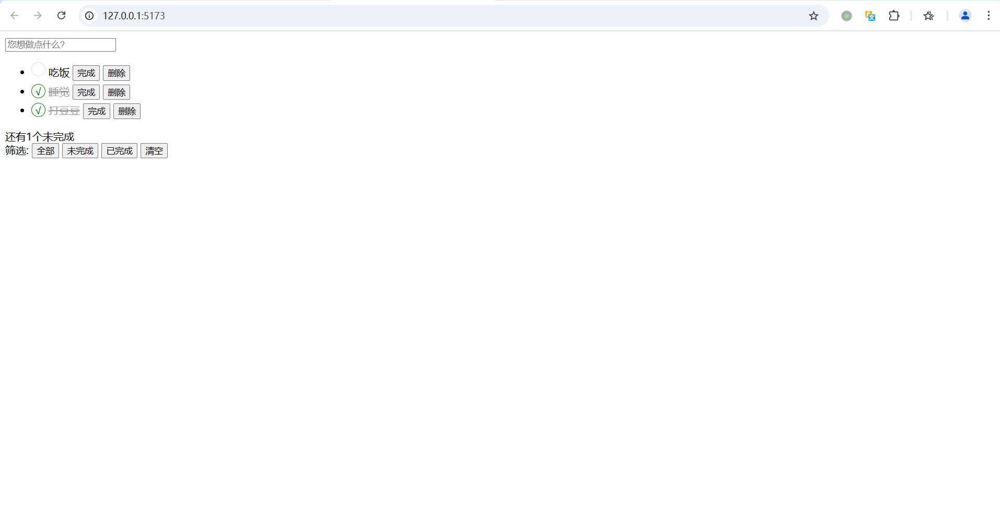

# 如何使用html+ts编写前端todo list

## 先决条件
1. 已创建vanilla ts工程

>**提示**                                  
若未安装vanilla ts工程，可以参考[vite的入门](https://github.com/idealjs/full-stack-tutorial/blob/main/docs/vite/vite.md)文档

## 项目初始化
打开vanilla ts工程

## 编写HTML结构
在`index.html`中，通过以下代码，编写todo list的样式和基本结构
```
<!DOCTYPE html>
<html lang="en">

<head>
  <meta charset="UTF-8">
  <meta name="viewport" content="width=device-width, initial-scale=1.0">
  <title>Document</title>
  <style>
    .icon-complete {
      display: inline-block;
      width: 20px;
      height: 20px;
      border: solid 1px #ddd;
      border-radius: 50%;
    }

    .icon-complete-active {
      border-color: green;
      text-align: center;
    }

    .todo-item {
      margin-bottom: 5px;
    }

    .icon-complete-active::after {
      content: "√";
      color: green;

    }

    .item-complete .todo-text {
      color: #999;
      text-decoration: line-through;
    }
  </style>
</head>

<body>
  <div>
    <input class="input-todo" type="text" placeholder="您想做点什么?">


    <ul class="todo-list">
      <li class="todo-item">
        <span class="icon-complete" onclick="onClickCompleteBtn(0)"></span>
        <span class="todo-text">吃饭</span>
        <button class="btn-complete">完成</button>
        <button class="deleted" onclick="deleteItem(0)">删除</button>
      </li>
      <li class="item-complete todo-item">
        <span class="icon-complete icon-complete-active" onclick="onClickCompleteBtn(1)"></span>
        <span class="todo-text">睡觉</span>
        <button class="btn-complete">完成</button>
        <button class="deleted" onclick="deleteItem(1)">删除</button>
      </li>
      <li class="item-complete todo-item">
        <span class="icon-complete icon-complete-active" onclick="onClickCompleteBtn(2)"></span>
        <span class="todo-text">打豆豆</span>
        <button class="btn-complete">完成</button>
        <button class="deleted" onclick="deleteItem(2)">删除</button>
      </li>
    </ul>
<div>
      <span>还有<span class="active-num">1</span>个未完成</span>
      <div class="fliter-btn-group">
        筛选:
        <button class="filter-btn filter-btn-all" data-complete="all">全部</button>
        <button class="filter-btn filter-btn-active" data-complete="false">未完成</button>
        <button class="filter-btn filter-btn-completed" data-complete="true">已完成</button>
         <button class="btn-clear">清空</buttosn>
      </div>
     
    </div>
    
  </div>
  <script src="./src/main.ts">
   </script>
</body>

</html>
```
## 编写TypeScript逻辑
在`main.ts`中，编写以下代码，实现todo list的功能
```
//定义接口TodoItem
interface TodoItem {
  name: string;
  completed: boolean;
}

//初始化数组
let list: TodoItem[] = [
  { name: '吃饭', completed: false },
  { name: '睡觉', completed: true },
  { name: '打豆豆', completed: true },
];

//监听在输入框中按下回车键的事件
document.querySelector('.input-todo')!.addEventListener('keyup', function (e: Event) {
  const event = e as KeyboardEvent;
  const target = event.target as HTMLInputElement;
  if (!target.value?.trim()) {
    return;
  }
  if (event.key === 'Enter') {
    const name = target.value;
    const item: TodoItem = { name, completed: false };
    list.push(item);
    render(list);
    target.value = '';
  }
});

//实现筛选功能
document.querySelectorAll('.filter-btn').forEach((el) => {
  el.addEventListener('click', filterCompletedStatus);
});

function filterCompletedStatus(e: Event) {
  const target = e.target as HTMLElement;
  const completed = target.dataset.complete;

  if (completed === 'all') {
    render(list);
    return;
  }

  const newList = list.filter((item) => item.completed === (completed === 'true'));
  renderTodoList(newList);
}

document.querySelector('.btn-clear')!.addEventListener('click', () => {
  list = [];
  render(list);
});

//切换completed的状态
function onClickCompleteBtn(index: number) {
  list[index].completed = !list[index].completed;
  render(list);
}

//渲染数组
function render(list: TodoItem[]) {
  UpdateActiveNum();
  renderTodoList(list);
}

//统计筛选中未完成功能数量
function UpdateActiveNum() {
  const completedNum = list.filter((item) => !item.completed).length;
  document.querySelector('.active-num')!.innerHTML = completedNum.toString();
}

//实现删除功能
function deleteItem(index: number) {
  list.splice(index, 1);
  render(list);
}

//渲染html
function renderTodoList(list: TodoItem[]) {
  let html = '';
  list.forEach((item, index) => {
    const itemClass = item.completed ? 'item-complete todo-item' : 'todo-item';
    const spanClass = item.completed ? 'icon-complete icon-complete-active' : 'icon-complete';
    html += `<li class="${itemClass}">
      <span onclick="onClickCompleteBtn(${index})" class="${spanClass}"></span>
      <span>${item.name}</span>
      <button class="btn-complete">完成</button>
      <button class="deleted" onclick="deleteItem(${index})">删除</button>
    </li>`;
  });
  document.querySelector('.todo-list')!.innerHTML = html;
}
```
## 运行项目
按下快捷键`Ctrl + ~`,打开终端，输入以下命令，运行项目
```
npm run dev
```
