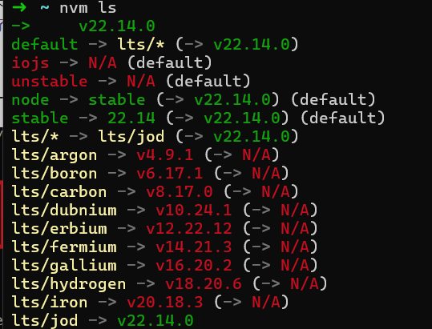

# nvm
- Node.js是用于服务器端JavaScript运行，适合高性能、实时应用
- NVM用于管理多个Node.js版本，便于在不同项目间切换

## 先决条件
1. 确保安装了Ubuntu

## 安装NVM
### 1. 安装cURL
在wsl中，运行以下命令：`install`
```
sudo apt-get install curl
```

### 2. 安装nvm
通过curl安装nvm,运行以下命令
```
curl -o- https://raw.githubusercontent.com/nvm-sh/nvm/master/install.sh | bash
```

### 3. 配置环境变量
在`~/.bashrc`文件中配置以下内容：
```
export NVM_DIR="$([ -z "${XDG_CONFIG_HOME-}" ] && printf %s "${HOME}/.nvm" || printf %s "${XDG_CONFIG_HOME}/nvm")"
[ -s "$NVM_DIR/nvm.sh" ] && \. "$NVM_DIR/nvm.sh" # This loads nvm
```

### 4. 验证nvm安装
若要验证安装，输入以下命令:`command -v nvm`；如果安装成功则返回nvm，如果收到"找不到命令"或无响应，关闭当前终端，重新打开，然后重试。
```
command -v nvm
```                     

### 5. 列出当前安装的Node版本
查看当前安装的版本号，输入以下命令:`nvm ls`
```
nvm ls
```

### 6. 安装Node.js(LTS)版本
这里我选择安装当前稳定的LTS版本，安装输入以下命令:`install --lts`
```
nvm install --lts
```

### 7. 验证Node.js安装
查看当前安装的版本号，输入以下命令：`version`
```
node --version
```